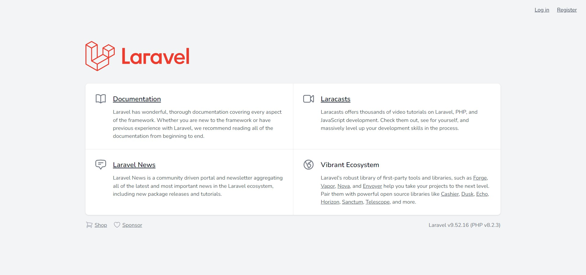
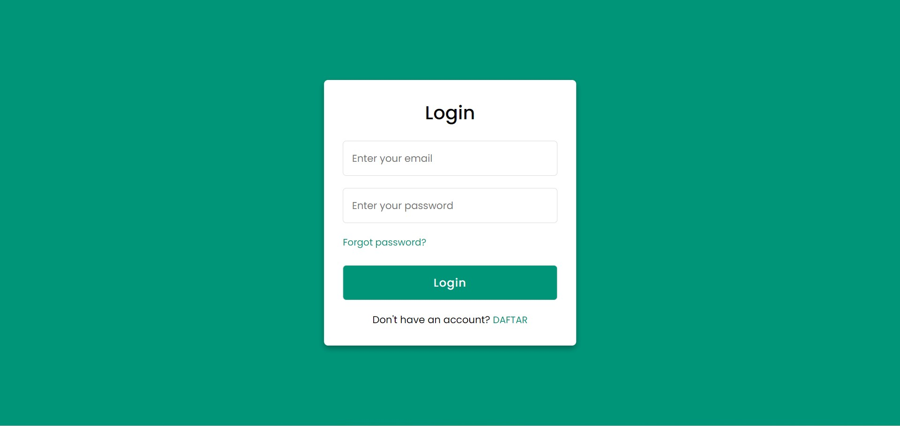
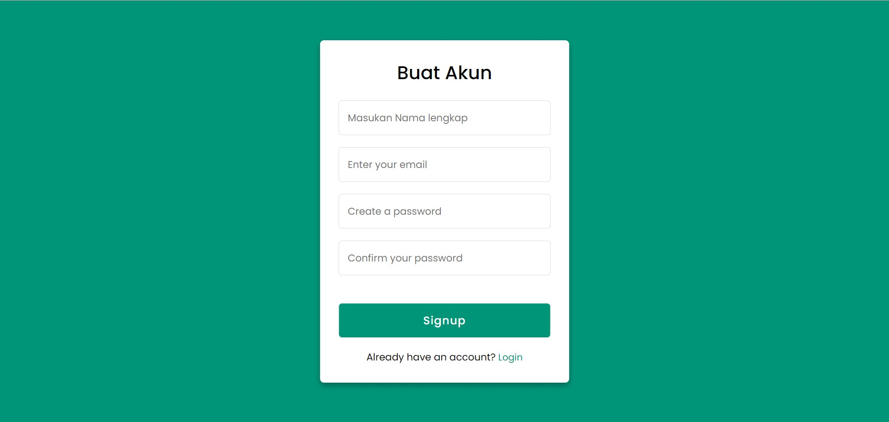
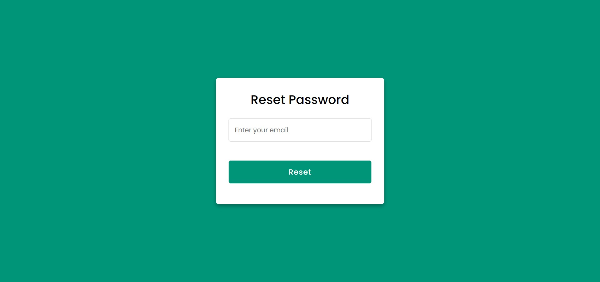
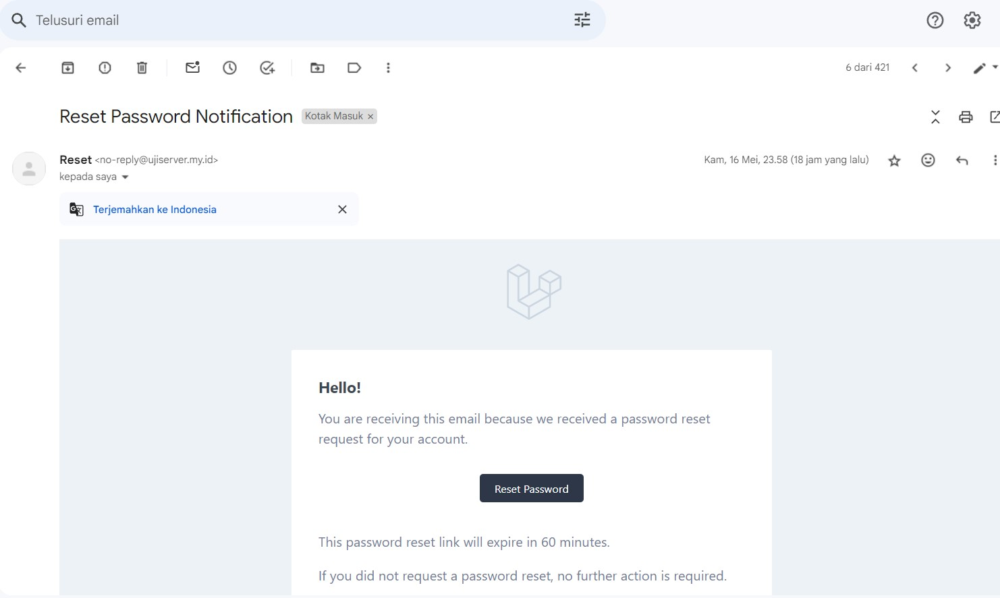

# Example Reset Passwrd + Email By Mailtraps | Laravel + Bootstrap

Example sederhana melakukan reset email yang di kirimkan ke email real atau email pribdai pada saat melakukan registrasi

## Fitur

- [x] Reset Password
- [x] Email Verification
- [x] Login
- [x] Register
- [x] Forgot Password

## Teknologi

**Client:** HTML, CSS, JavaScript, Bootstrap

**Server:** PHP, Laravel

**DataBase:** MySql

## Instalasi

berikut ini merupakan panduan instalasi sistem inventaris

Clone Repository

```bash
git clone git@github.com:anous/LARAVEL-EXAMPLE-PRESET-PASSWORD-MAILTRAPS.git
```

Composer Update

```bash
cp composer update
```

Create .env file

```bash
cp .env.example .env
```

Lakukan generate key

```bash
php artisan key:generate
```

Nyalakan Web Server

```bash
php artisan serve --port=8001
```

Jika Semua sudah,maka dapat di jalankan di browser.

## Screenshots

**HALAMAN UTAMA**

**HALAMAN LOGIN**

**HALAMAN REGISTRASI**

**HALAMAN RESET PASSWORD**

**HALAMAN EMAIL NOTIFIKASI**


## Feedback

Silahkan Berikan Feedback atau Pertanyaan ke Email dengan menekan tombol "Hubungi Kami" di bawah ini:

[](mailto:mikozua45@gmail.com)
